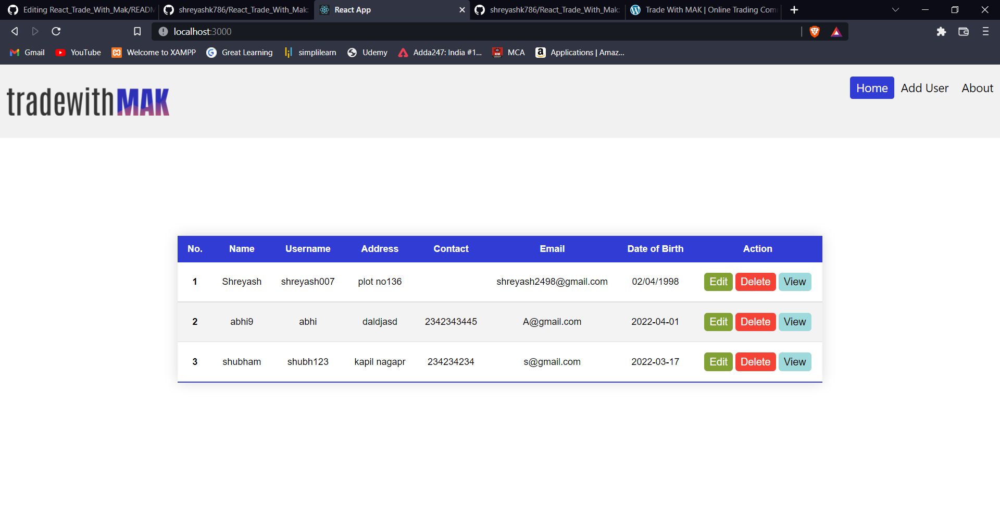
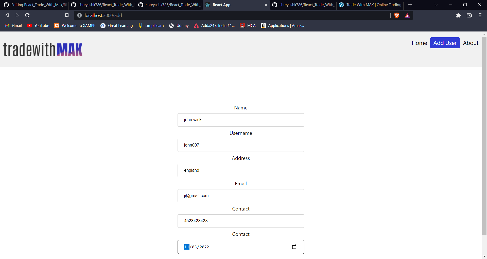
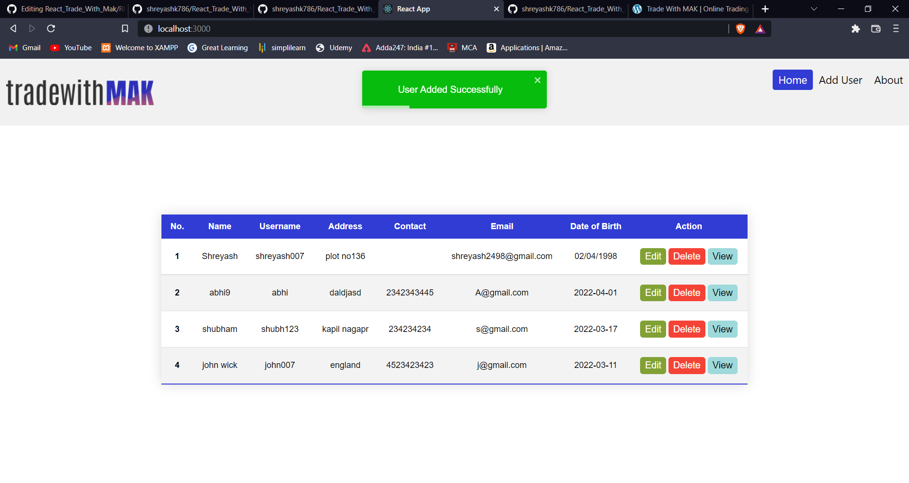
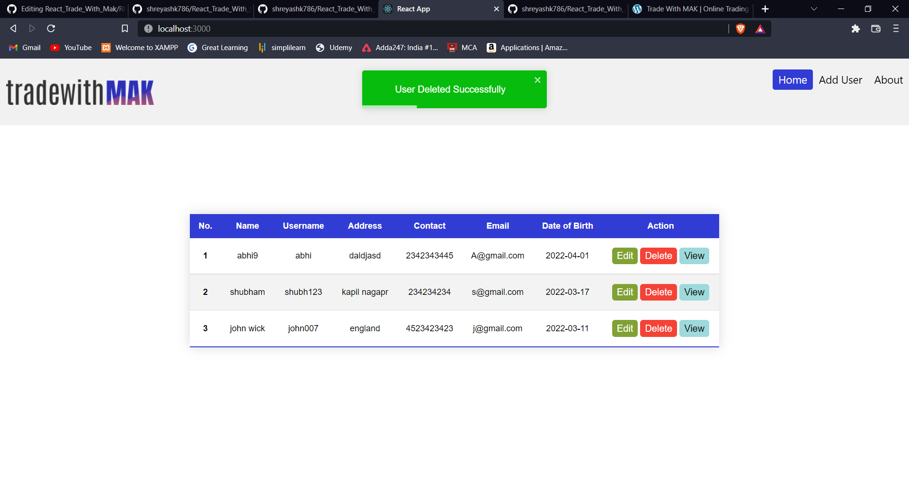
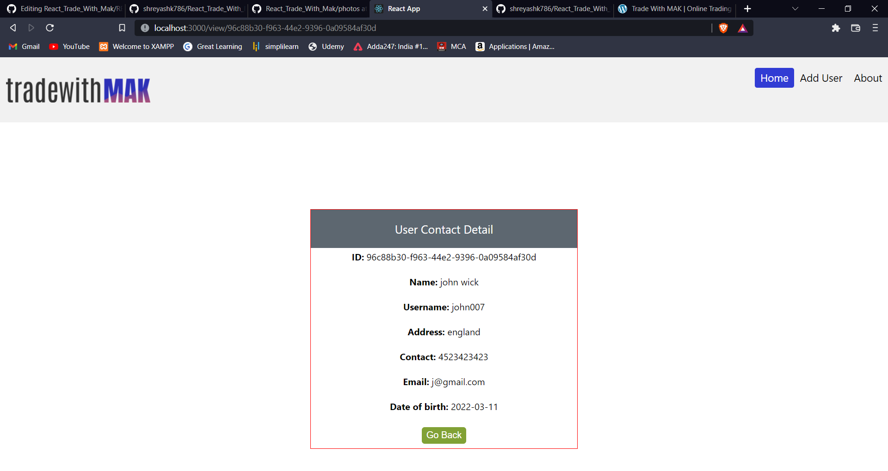

# React_Trade_With_Mak
In this project ReactJs is used as Frontend. NodeJs, ExpressJs is used as backend. Database is not used. all operations are performed by RestApi

 
User Table dashboard
    
Adding User
    
User Added Popup

Deleting User Popup
   
User View

