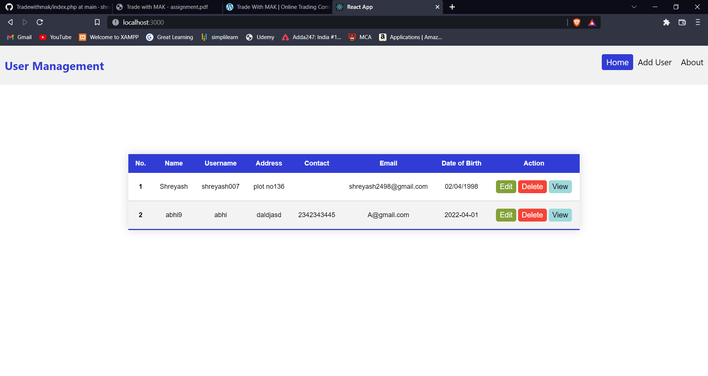
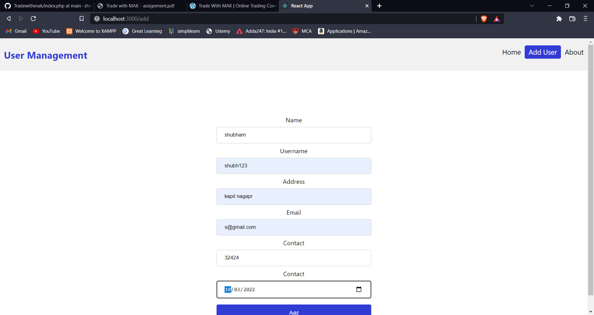
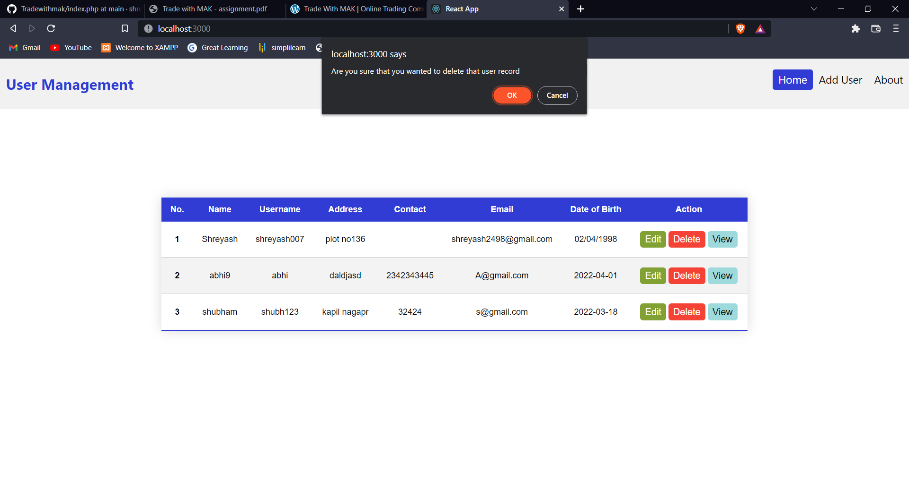
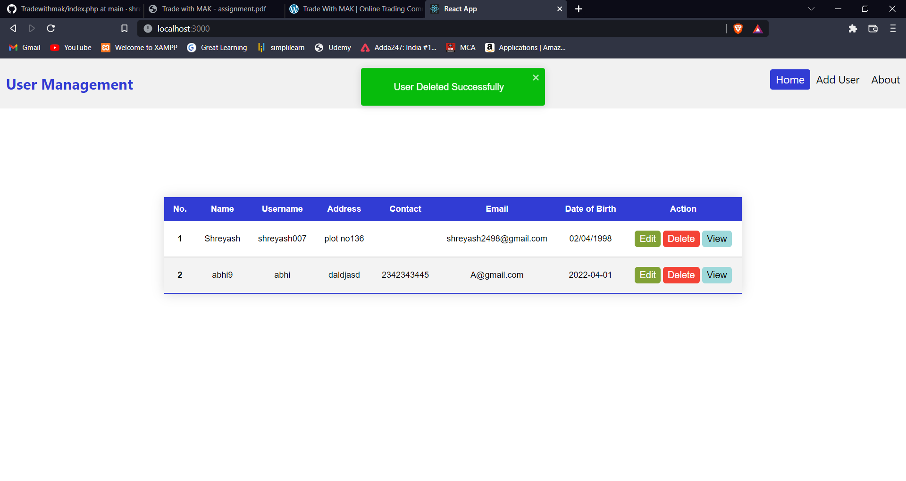
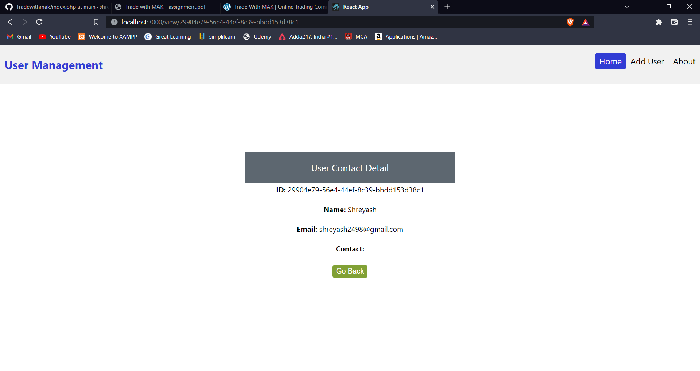

# React_Trade_With_Mak
In this project ReactJs is used as Frontend. NodeJs, ExpressJs is used as backend. Database is not used. all operations are performed by RestApi

 
##User Table dashboard
    
##Adding User
    
##User Added Popup

Deleting User Popup

##User added Popup
   
##User View

